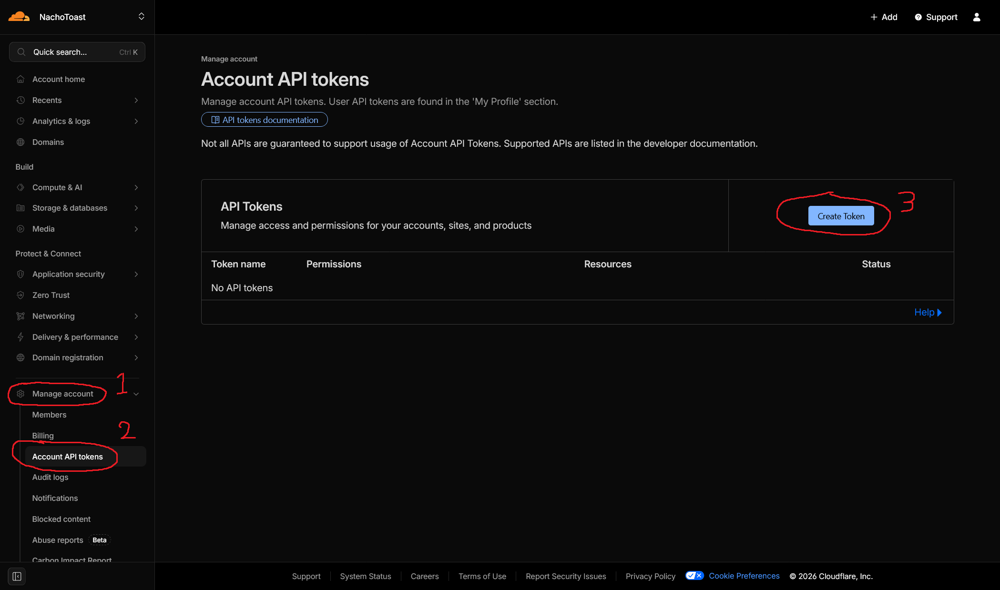
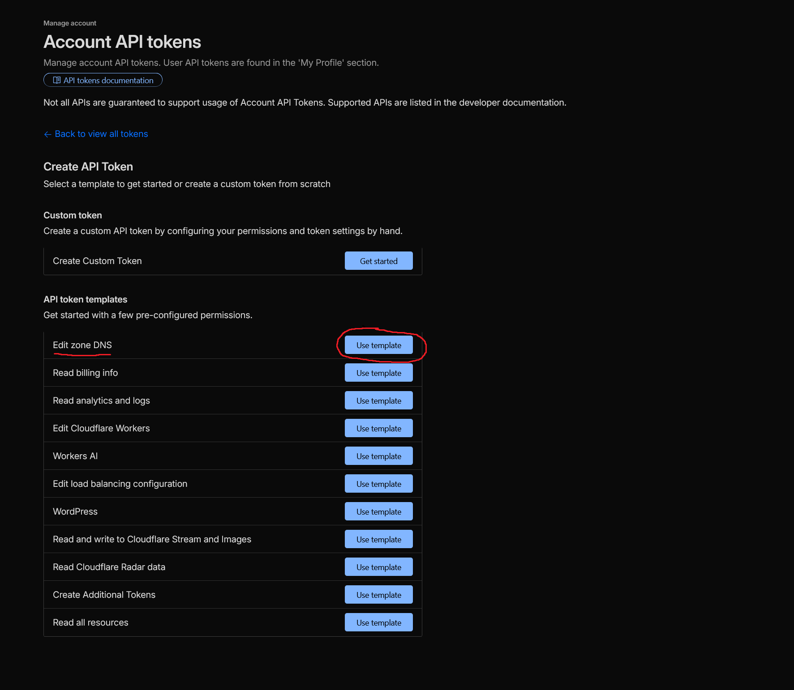
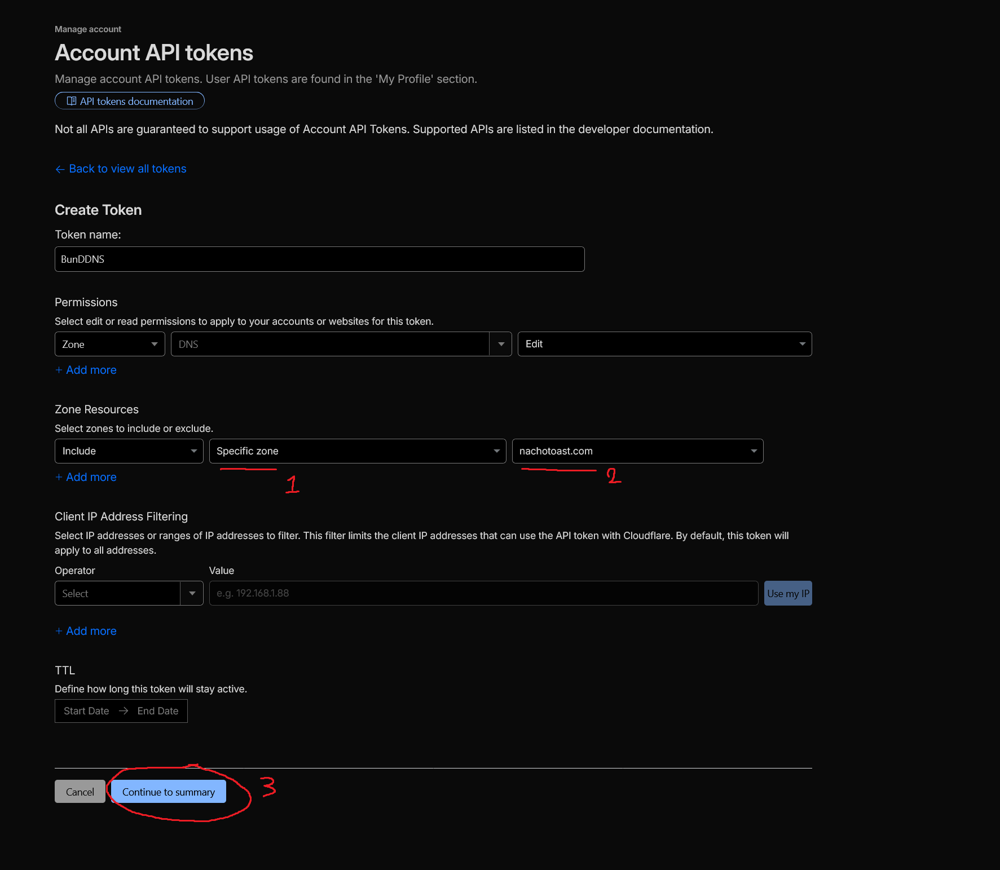
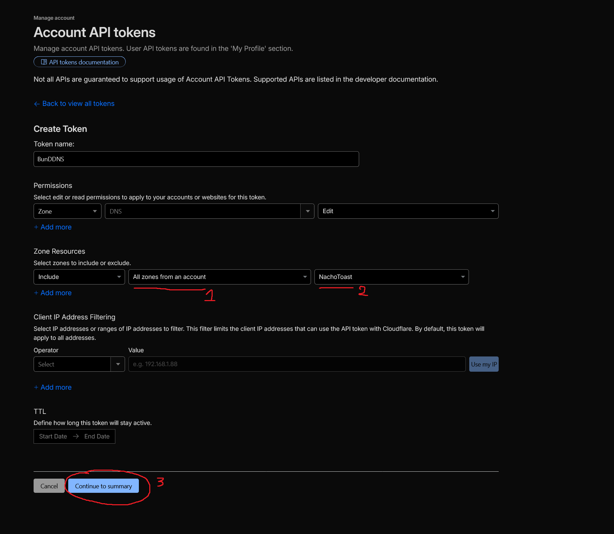
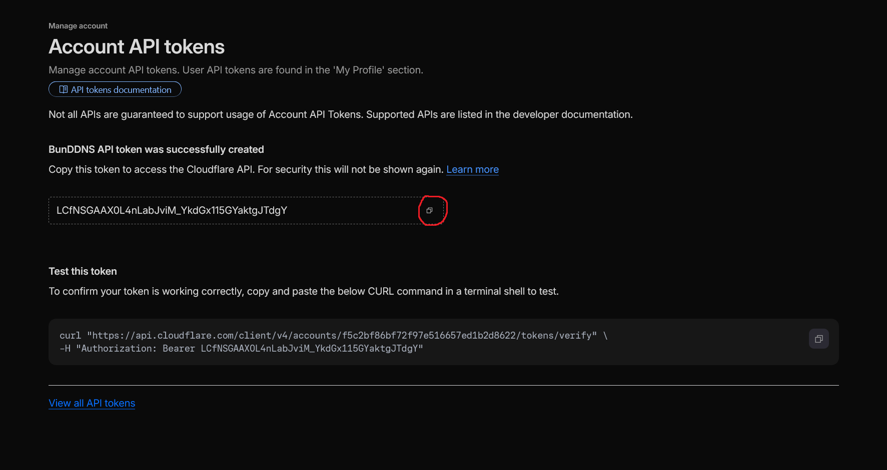
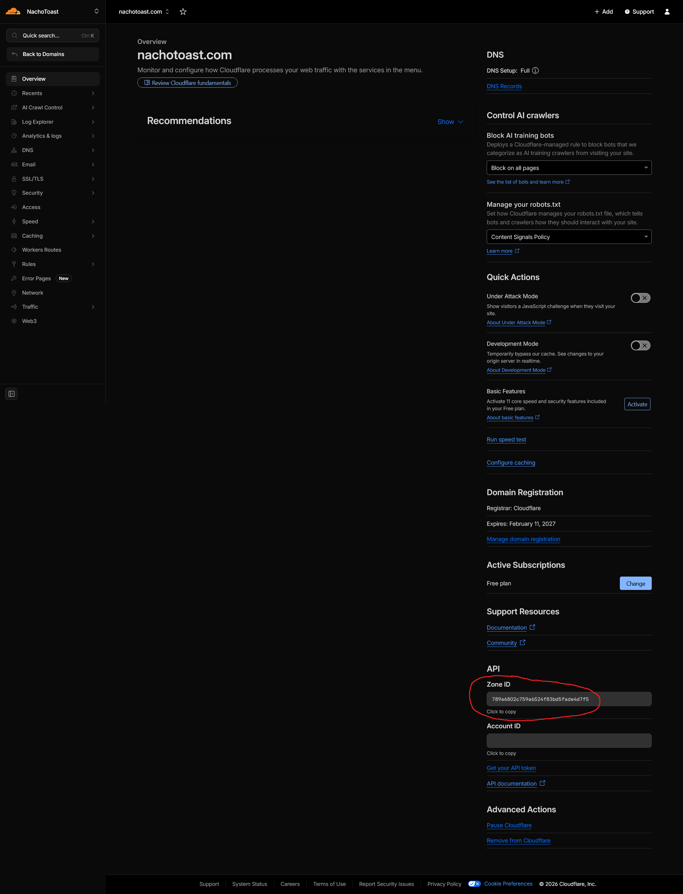
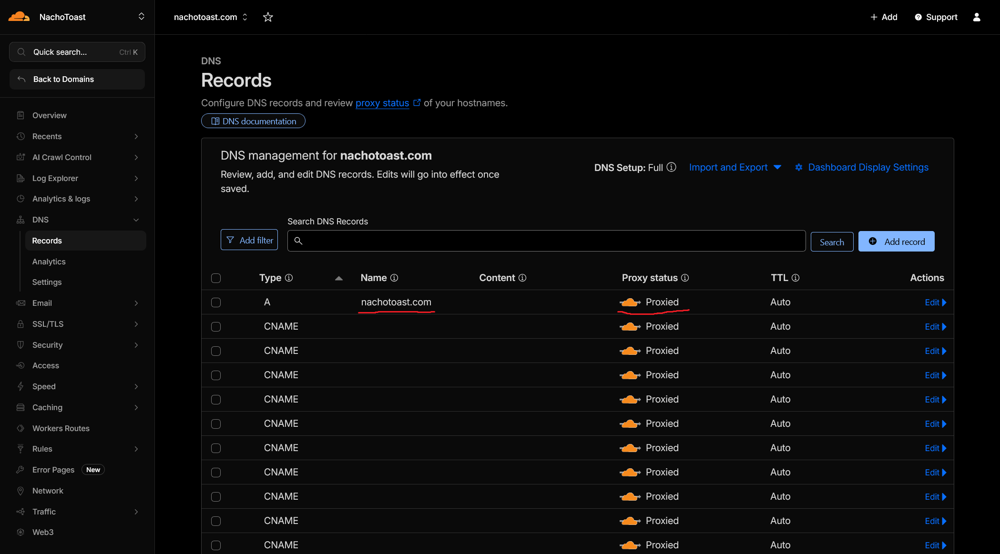
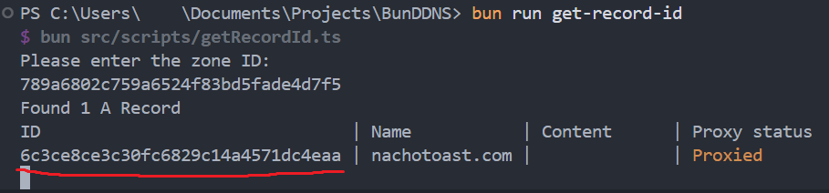

# Setup Guide <!-- omit in toc -->

> [!NOTE]
> This assumes you have [git](https://git-scm.com/) and [Bun](https://bun.com/get) already installed.

- [1. The Basics](#1-the-basics)
- [2. Cloudflare Token](#2-cloudflare-token)
- [3. Cloudflare Zone IDs](#3-cloudflare-zone-ids)
- [4. Done](#4-done)

## 1. The Basics

Run the following commands in a terminal where you want to install the tool:

```sh
git clone https://github.com/NachoToast/BunDDNS.git
cd BunDDNS
bun install
cp .env.example .env
cp config.example.json config.json
```

## 2. Cloudflare Token

From the sidebar on https://dash.cloudflare.com/, navigate to **Manage account** > **Account API tokens** > **Create Token**



---

Click **Use template** next to "Edit zone DNS"



---

Under the "Zone Resources" section, select the specific domains you want to use

> [!TIP]
> Set a name for your token while you're here.

<details open>
    <summary>For Specific Domain(s)</summary>

<br />



</details>

<details>
    <summary>For All Domains</summary>

<br />



</details>

---

Click **Continue to summary** at the bottom of the page, then **Create Token**. Copy the token's value into the `.env` file you created in step 1.

> [!CAUTION]
> Treat this token the same way you would treat a password!



## 3. Cloudflare Zone IDs

> [!IMPORTANT]
> Repeat these steps for every domain you want to use this tool with.

Make a new entry in the **domains** section of `config.json`

```json
{
    "$schema": ".github/config-schema.json",
    "dnsRecords": [
        {
            "zoneId": "",
            "recordId": "",
            "name": "",
            "proxied": true
        }
    ]
}
```

---

The **zoneId** can be found in Cloudflare's domain overview page (near the bottom of the sidebar):



---

The **proxied** and **name** values come from the `A` record for the domain:



---

The **recordId** needs to be located via running the `bun get-record-id` command in a terminal:



## 4. Done

The final `config.json` should now look like this:

```json
{
    "$schema": ".github/config-schema.json",
    "dnsRecords": [
        {
            "zoneId": "789a6802c759a6524f83bd5fade4d7f5",
            "recordId": "6c3ce8ce3c30fc6829c14a4571dc4eaa",
            "name": "nachotoast.com",
            "proxied": true
        }
    ]
}
```

Or like this if you set up multiple domains:

```json
{
    "$schema": ".github/config-schema.json",
    "dnsRecords": [
        {
            "zoneId": "789a6802c759a6524f83bd5fade4d7f5",
            "recordId": "6c3ce8ce3c30fc6829c14a4571dc4eaa",
            "name": "nachotoast.com",
            "proxied": true
        },
        {
            "zoneId": "7e745164e18972405db24181260c03eb",
            "recordId": "856686d1eaa939866af88eb3051c100c",
            "name": "another-value",
            "proxied": true
        }
    ]
}
```

You can now run the tool via `bun .` or `bun start`

If you have [Docker](https://www.docker.com/products/docker-desktop/) installed, you can also start the tool in a container:

```sh
docker compose up --build --detach
```
